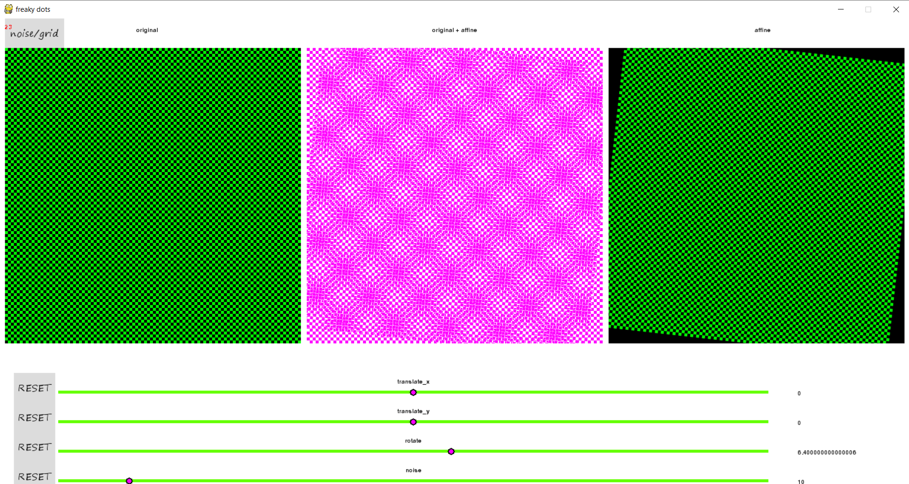
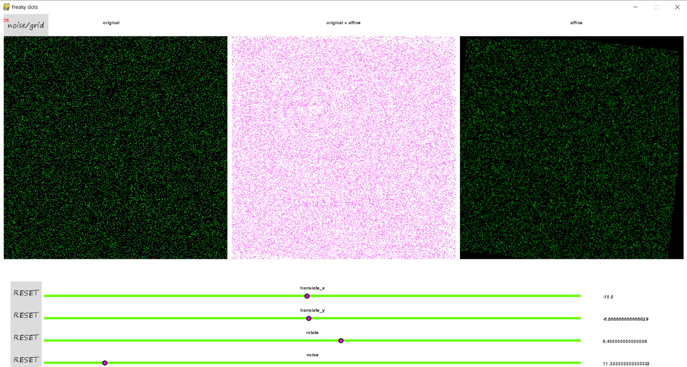

# freaky-dots
Pattern generation using noise

## Installation
clone this repository and execute the following commands:
   ##### to install requirements:
          pip install -r requirements.txt 
   ##### to try the code:
          python freaky_dots.py
   ###### note: move the sliders slowly to see the patterns
## screen-shots

